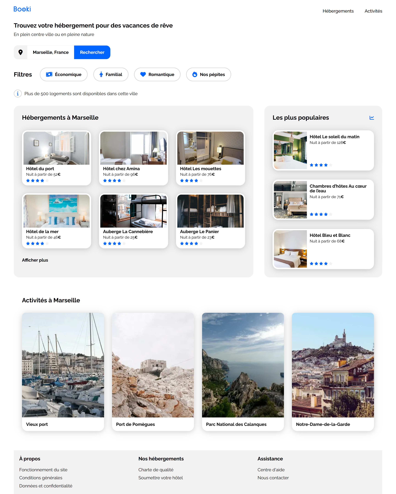

# 📚 Projet Booki - Site de Réservation d'Hébergements

## 🖼️ Captures d'Écran

### Version Desktop



### Versions Responsive

- [Version Tablette](images/screenShot/Booki_Tablet_1024px.png)
- [Version Mobile](images/screenShot/Booki_Mobile_375px.png)

## 🎯 Description du Projet

**Booki** est une page web statique de présentation d'hébergements de vacances, développée dans le cadre de la formation OpenClassrooms. Interface moderne et responsive présentant des hébergements (ici, à Marseille) et des activités touristiques.

### 📧 Contexte du Projet

Vous débutez votre alternance en tant que développeur web au sein de la start-up Booki.
L'entreprise souhaite développer un site Internet qui permette aux usagers de trouver des hébergements et des activités dans la ville de leur choix.
Vous êtes chargé d'intégrer l'interface du site avec du code HTML et CSS.
=> Travail en collaboration avec Sarah, la CTO, et Loïc, l'UI designer.
Sarah vous a envoyé un e-mail pour vous présenter l'avancée du projet.

## ✨ Fonctionnalités Principales

### 🔍 Section de Recherche

- **Barre de recherche** avec placeholder pour les villes
- **Filtres visuels** : Économique, Familial, Romantique, Nos pépites
- **Interface intuitive** avec icônes Font Awesome

### 🏨 Section Hébergements

- **Affichage en grille** des hébergements disponibles
- **Cartes détaillées** avec photos, prix et notes
- **Système de notation** avec étoiles (1-5 étoiles)
- **Section "Les plus populaires"** mise en avant

### 🎯 Section Activités

- **Activités touristiques** de Marseille
- **Photos haute qualité** des attractions
- **Navigation fluide** entre les sections

### 📱 Design Responsive

- **Adaptation mobile** (320px minimum)
- **Design tablette** optimisé
- **Interface desktop** complète (max 1440px)

## 🛠️ Technologies Utilisées

- **HTML5** - Structure sémantique
- **CSS3** - Styles et animations (Variables CSS, Flexbox, Media queries, Nesting CSS natif)
- **Font Awesome** - Icônes vectorielles
- **Google Fonts** - Police Raleway

## 📁 Structure du Projet

```
Projet2_OCR_Booki/
├── index.html                 # Page principale
├── css/                       # Styles CSS modulaires
│   ├── general.css           # Styles généraux et variables
│   ├── header.css            # Navigation et logo
│   ├── research-filters.css  # Barre de recherche et filtres
│   ├── card.css              # Styles des cartes
│   ├── hebergements-and-pop.css # Section hébergements
│   ├── activities.css        # Section activités
│   └── footer.css            # Pied de page
├── images/                    # Ressources graphiques
│   ├── logo/                 # Logo Booki
│   ├── hebergements/         # Photos hébergements (JPG)
│   ├── hebergements-webp/    # Photos hébergements (WebP)
│   ├── activites/            # Photos activités (JPG)
│   ├── activites-webp/       # Photos activités (WebP)
│   └── screenShot/           # Captures d'écran
└── README.md                 # Documentation
```

## 🚀 Installation et Utilisation

### Prérequis

- Un navigateur web moderne (Chrome, Firefox, Safari, Edge)

### Lancement

1. **Téléchargez** ou **clonez** le projet
2. **Ouvrez** le fichier `index.html` dans votre navigateur
3. **Naviguez** librement sur le site

### Navigation

- **Menu de navigation** : Liens vers les sections Hébergements et Activités
- **Scroll fluide** entre les sections
- **Responsive** : Redimensionnez la fenêtre pour tester l'adaptation

## 🎨 Design et Interface

### Palette de Couleurs

- **Bleu principal** : #0065FC
- **Gris clair** : #F2F2F2
- **Bleu clair** : #DEEBFF
- **Blanc** : #FFFFFF
- **Noir** : #000000

### Typographie

- **Police principale** : Raleway (Google Fonts)
- **Tailles** : 16px (général), 22px (titres de section)
- **Poids** : 400, 500, 700

## 📱 Responsive Design

### Breakpoints

- **Mobile** : 320px - 767.98px
- **Tablette** : 768px - 1023px
- **Desktop** : 1024px - 1440px

### Optimisations

- **Images WebP** pour un chargement plus rapide
- **Lazy loading** sur les images
- **Attributs ARIA** pour l'accessibilité
- **CSS modulaire** pour la maintenance

## 📋 Fonctionnalités pouvant être apportées

- [ ] Système de réservation en ligne
- [ ] Authentification utilisateur
- [ ] Système de favoris
- [ ] Recherche géolocalisée
- [ ] Intégration de cartes interactives
- [ ] Fonctionnalités JavaScript pour l'interactivité

## 👨‍💻 Développement

Ce projet a été développé dans le cadre de la formation **Développeur Web** d'OpenClassrooms, mettant en pratique les compétences en HTML, CSS et responsive design.

---

**Auteur** : Fanny  
**Formation** : OpenClassrooms - Développeur Web  
**Date** : 2025
